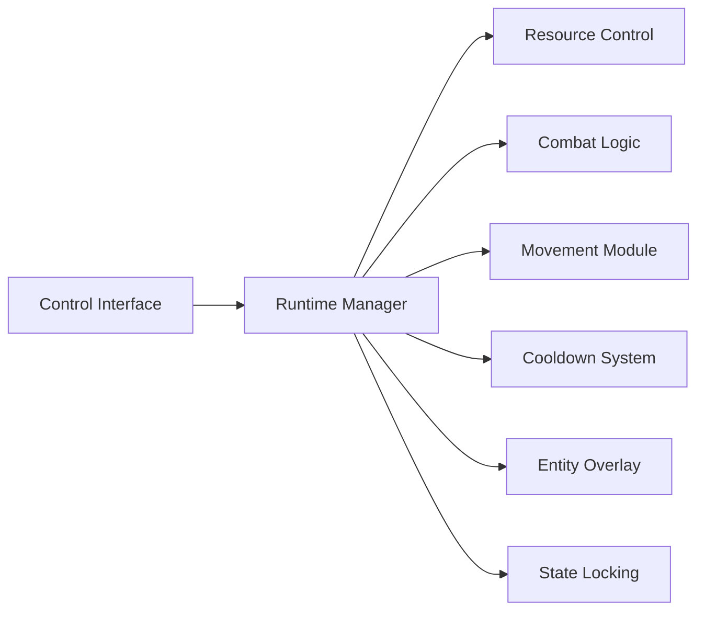

## Overview

Darkhaven Trainer is a runtime control utility designed to interact with active Darkhaven sessions through external, modular systems. It provides structured access to editable parameters, conditional state management, and value interception without modifying original game files. The trainer operates through a centralized runtime manager that coordinates combat tuning, movement adjustment, resource regulation, and awareness layers. Secondary systems integrate dynamically, allowing precise control over gameplay variables while maintaining session-bound isolation and predictable behavior across modules.

## Resource and Attribute Regulation Module

* Health value stabilization
* Mana consumption scaling
* Stamina drain adjustment
* Regeneration rate control

**In-game behavior:**
This module intercepts attribute calculations at runtime, applying normalization or override rules before final values are resolved.

## Combat Logic Adjustment Layer

* Damage output multipliers
* Incoming damage reduction
* Critical hit enforcement
* Conditional combat state toggles

**Feature intent:**
Modifies combat evaluation logic dynamically, ensuring controlled outcomes without directly altering stored combat data.

## Movement and Traversal Modifier

* Movement speed scaling
* Jump height adjustment
* Gravity influence tuning
* Collision constraint handling

**In-game behavior:**
Applies modifiers to movement-related parameters prior to physics resolution, maintaining consistency across frames.

## Ability Cooldown Management System

* Cooldown freeze toggles
* Instant reset triggers
* Ability-specific cooldown rules
* Conditional timer enforcement

**Feature intent:**
Controls ability timers by locking or recalculating cooldown states during active gameplay.

## Entity Awareness and Overlay Layer

* Enemy and NPC highlighting
* Distance-based visibility filters
* Line-of-sight checks
* Adjustable update frequency

**In-game behavior:**
Renders supplemental spatial data through an isolated overlay layer, separate from the native rendering pipeline.

## State Lock and Freeze Engine

* Boolean and numeric state locks
* Priority-based override hierarchy
* Temporary lock timers
* Safe release on session end

**Feature intent:**
Ensures selected runtime states remain unchanged until explicit release conditions are met.

## Configuration and Profile Handler

* Multiple configuration profiles
* Hot-reload support
* Version compatibility checks
* Default fallback recovery

**In-game behavior:**
Maintains consistent feature behavior across sessions while allowing rapid reconfiguration during runtime.

## FAQ

**Does the trainer modify Darkhaven files?**
No. All interactions occur externally at runtime.

**Can modules be enabled independently?**
Yes. Each feature system operates independently.

**Are changes saved after restarting the game?**
No. All modifications are session-based.

**Is the overlay required for other features?**
No. Visualization modules are optional.

**Can profiles be switched during gameplay?**
Yes. Profiles support hot-reloading.

**Does state locking affect all systems globally?**
Locks apply only to explicitly selected parameters.

## Feature Summary

* Resource and attribute regulation system
* Combat logic adjustment layer
* Movement and traversal modifiers
* Ability cooldown management
* Entity awareness and overlay system
* Runtime state lock and freeze engine
* Persistent configuration and profile handling

---
